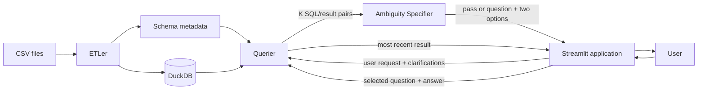

# DB Whisperer Architecture

## Overview

DB Whisperer lets users query CSV data using natural language. It loads one CSV
into DuckDB, generates SQL, executes it, and displays the result.

The project uses Python, Streamlit, DuckDB, and OpenRouter.

## Components

### Component A: ETLer

Imports one or more CSV files into DuckDB (one table per file), exposes
per-table and column metadata, and discovers foreign-key relationships between
tables from naming hints confirmed by value overlap.

**Input:** One or more CSV files.

**Output:** DuckDB database, per-table schema metadata, and discovered
relationships. Relationships are advisory metadata only and are never enforced
as DuckDB constraints.

### Component B: Ambiguity Specifier

Detects whether the user's request maps to more than one valid interpretation
and, if so, returns one clarifying question with exactly two answer options.
Component B has two complementary mechanisms and never generates SQL, executes
queries, or manages the loop.

**Primary mechanism -- schema-graph join-path multiplicity.** Before any SQL is
generated, an LLM extracts the entities a question mentions and maps them to
tables. The schema graph (assembled from Component A's discovered foreign keys)
enumerates the distinct join paths between those tables. When more than one
distinct path connects an entity pair, the request is ambiguous -- the same
wording joins the data differently with different results. The clarifying
question (LLM-written, with a deterministic fallback) asks the user which
connection they mean. The canonical example is "labs for patient X", which can
join `labevents` directly to `patients` by `subject_id` or through a hospital
visit (`admissions`). Pure graph assembly and path enumeration live in
`schema_graph/`; the LLM steps live in `ambiguity/`.

**Secondary mechanism -- executed-candidate comparison.** When join-path
detection passes (a single path, fewer than two entity tables, or no graph), the
application generates K SQL candidates, executes them, and Component B compares
the SQL/table pairs to decide whether they expose a material ambiguity, again
returning a pass or one two-option question.

Both mechanisms return a pass decision or one clarifying question with exactly
two answer options, tagged with the mechanism that produced it.

### Component C: Querier

Converts one natural-language request into DuckDB SQL using database context and
an LLM.

It builds the prompt from static instructions, quoted schema DDL, five sample
rows, table shape, column statistics, a schema-derived identifier allowlist, and
a RELATIONSHIPS section listing discovered foreign keys so the model can join
tables. User-confirmed ambiguity clarifications are appended when available. It
then validates and executes the generated SQL.

**Input:** User request, DuckDB database, and OpenRouter configuration.

**Output:** Generated SQL and query result.

### Component D: Application and GUI

Provides the Streamlit interface and coordinates the complete workflow.

For each iteration, the application asks Component C for a user-selected number
of independently generated SQL queries and processes them concurrently through
a bounded worker pool. The default is three. Results are restored to candidate
order before Component B compares the SQL/result pairs. The application either
displays the most recent result, shows one clarifying question with two
clickable options, or stops after three iterations and displays the most recent
result. The selected question and answer are appended to the next Querier
prompt.

## High-Level Flow



## Project Structure

```text
src/db_whisperer/
|-- application/    # Workflow orchestration
|-- etler/          # CSV ingestion and schema metadata
|-- schema_graph/   # FK graph assembly and join-path enumeration
|-- ambiguity/      # Join-path detection and candidate comparison
|-- querier/        # SQL generation, validation, and execution
|-- gui/            # Streamlit interface
`-- contracts.py    # Shared component data models
```

## Key Constraints

- Only read-only SQL is allowed.
- OpenRouter credentials are supplied through environment variables.
- Every prompt and raw LLM response is appended to `logs/prompts.jsonl`.
- Prompt and response records share a request ID for correlation.
- Candidate generation, SQL validation, and execution outcomes are logged with
  attempt numbers, SQL when available, and failure reasons.
- Logs contain database context and may contain sensitive CSV values. API keys
  are not logged.
