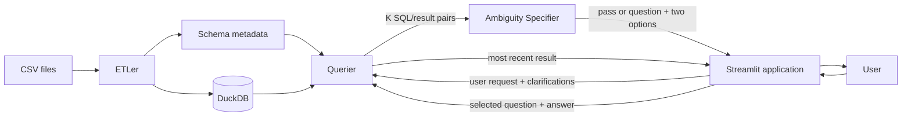

# DB Whisperer Architecture

## Overview

DB Whisperer lets users query CSV data using natural language. It loads one CSV
into DuckDB, generates SQL, executes it, and displays the result.

The project uses Python, Streamlit, DuckDB, and OpenRouter.

## Components

### Component A: ETLer

Imports one CSV file into DuckDB and exposes its table and column metadata to
the rest of the system.

**Input:** One CSV file.

**Output:** DuckDB database and schema metadata.

### Component B: Ambiguity Specifier

Evaluates whether K generated SQL queries and their executed result tables
represent the same interpretation of the user's request.

It receives the original user query plus K SQL/table pairs and uses an LLM to
return either:

- A pass decision.
- One clarifying question with exactly two answer options.

Component B does not generate SQL, execute queries, or manage the loop.

### Component C: Querier

Converts one natural-language request into DuckDB SQL using database context and
an LLM.

It builds the prompt from static instructions, quoted schema DDL, five sample
rows, table shape, column statistics, and a schema-derived identifier allowlist.
User-confirmed ambiguity clarifications are appended when available. It then
validates and executes the generated SQL.

**Input:** User request, DuckDB database, and OpenRouter configuration.

**Output:** Generated SQL and query result.

### Component D: Application and GUI

Provides the Streamlit interface and coordinates the complete workflow.

For each iteration, the application asks Component C for a user-selected number
of independently generated SQL queries and processes them concurrently through
a bounded worker pool. The default is three. Results are restored to candidate
order before Component B compares the SQL/result pairs. The application either
displays the most recent result, shows one clarifying question with two
clickable options, or stops after three iterations and displays the most recent
result. The selected question and answer are appended to the next Querier
prompt.

## High-Level Flow



## Project Structure

```text
src/db_whisperer/
|-- application/   # Workflow orchestration
|-- etler/         # CSV ingestion and schema metadata
|-- ambiguity/     # Candidate comparison and clarification
|-- querier/       # SQL generation, validation, and execution
|-- gui/           # Streamlit interface
`-- contracts.py   # Shared component data models
```

## Key Constraints

- Only read-only SQL is allowed.
- OpenRouter credentials are supplied through environment variables.
- Every prompt and raw LLM response is appended to `logs/prompts.jsonl`.
- Prompt and response records share a request ID for correlation.
- Candidate generation, SQL validation, and execution outcomes are logged with
  attempt numbers, SQL when available, and failure reasons.
- Logs contain database context and may contain sensitive CSV values. API keys
  are not logged.
