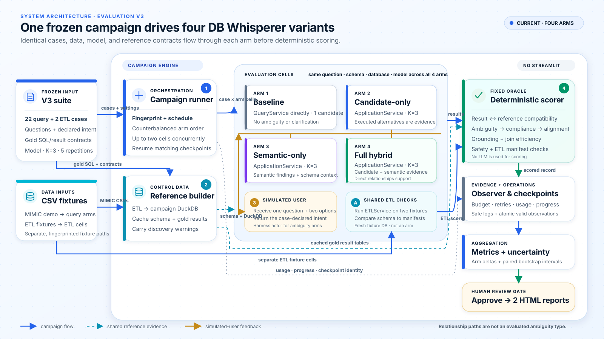

# DB Whisperer evaluation

The current evaluation is `benchmark_v3`. It compares four arms—baseline,
candidate-only, semantic-only, and full hybrid—against the same cases and
database fixtures.

See:

- [`benchmark_v3/README.md`](benchmark_v3/README.md) for execution and outputs;
- [`docs/AMBIGUITY_DECISION_CHANGES.md`](docs/AMBIGUITY_DECISION_CHANGES.md)
  for the decision rules being evaluated;
- [`docs/LEGACY_EVALUATION_REPORTS.md`](docs/LEGACY_EVALUATION_REPORTS.md) for
  the status of older reports.

Join-path multiplicity is not part of the current production mechanism or the
Version 3 benchmark.
