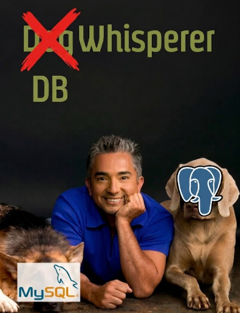

# DB Whisperer

Exploring your database has never been easier. We introduce an interactive and iterative process of analysing your data.

## Live Demo

[Open DB Whisperer](https://db-whisperer.streamlit.app/)



## How to Use

1. Get an API key at [OpenRouter](https://openrouter.ai/keys).
2. Open the live demo
3. Start chatting.

The API key is sent to OpenRouter for the current session and is not saved in any way. 

## Design

- [Application architecture](ARCHITECTURE.md)
- [Evaluation architecture](EVALUATION.md)

## Run Locally

```powershell
python -m pip install -r requirements.txt
streamlit run app.py
```
