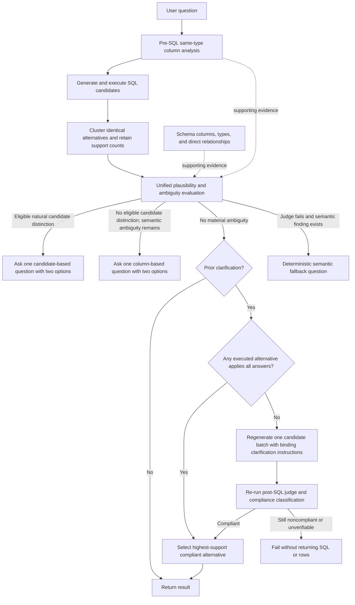

# Ambiguity Decision Changes

## Outcome

DB Whisperer now makes one combined ambiguity decision after SQL candidates
have been generated and executed. Candidate SQL/result differences are the
primary evidence only after a natural-language plausibility gate. Same-type
semantic column findings, schema columns and data types, and direct discovered
relationships provide supporting context.

Join-path multiplicity is no longer an ambiguity type. The system does not
enumerate alternate paths, ask users to choose a route, or expose graph-path
decisions in the application flow.

## Decision flow

The pre-SQL analysis records possible semantic ambiguity but never interrupts
SQL generation. This lets the executed alternatives remain the strongest
signal while still preserving vague same-type column evidence.

## Evidence hierarchy

1. **Plausible executed SQL/result alternatives:** materially different
   filters, joins, entity scope, time ranges, aggregations, result grain,
   ordering semantics, selected meaning, or null handling that also represent
   coherent, natural readings of the request.
2. **Same-type column findings:** vague terms mapped to multiple temporal,
   numeric, boolean, or textual columns.
3. **Schema support:** exact columns, data types, and direct discovered
   relationships used to interpret the first two signals.

Schema metadata cannot independently establish relationship-path ambiguity.
An eligible candidate distinction takes priority over semantic evidence. If a
candidate difference is an unsupported model outlier or an unnatural reading,
it is discarded and semantic evidence may become actionable. When several
eligible distinctions exist, the model selects the most important unresolved
two-way distinction, following Version 1 behavior.

## Observed failure and engineering reasoning

The monitored request `Show me all the patients from 2024` exposed the gap in
the earlier priority rule. Two candidates interpreted the request as patients
born in 2024. One candidate used `dob in 2024 OR dod in 2024`. The pre-SQL
semantic analysis independently identified `patients.dob` and
`admissions.admittime`.

The old judge treated the singleton SQL union as authoritative candidate
ambiguity and asked `Born in 2024` versus `Born or passed away in 2024`. That
question reflected a syntactic SQL difference, but the second option was not a
coherent way people naturally use `patients from 2024`. The stronger semantic
distinction was birth year versus admission year.

The resulting design principle is: **candidate diversity is primary evidence,
not proof that every generated interpretation is valid user intent**. SQL
generation remains blind to pre-SQL findings, so semantic analysis cannot
steer all candidates toward one answer. Plausibility is evaluated only after
the candidates execute.

### Why soft weighting was selected

- Exact duplicate SQL/results are clustered and retain their support count.
- Support is confidence, not majority voting. A singleton interpretation may
  still be legitimate when the wording or schema/semantic evidence supports
  it.
- Hard consensus was rejected because a real minority interpretation could be
  lost with only three candidates.
- A second LLM critic was rejected because it adds another paid call and more
  latency. The unified judge performs the plausibility gate in its existing
  call.
- The GUI default remains three candidates; users can increase it when broader
  coverage is worth the cost.

### Candidate option quality

A candidate-derived question is eligible only when both options are natural,
coherent readings of the request, address one semantic dimension, and are
self-contained and mutually exclusive. Arbitrary unions and subset/superset
choices such as `A` versus `A or B` are rejected unless the wording explicitly
supports inclusive scope. A singleton alternative must be directly supported
by the request or corroborated by semantic/schema evidence.

Each exact alternative has a stable round-local ID such as `alternative_1`.
Candidate clarifications must return exactly two valid alternative IDs. The
final decision log records those IDs, every cluster's support count, any
candidate-rejection rationale, and fallback state.

## Clarification cardinality

Each workflow round can present at most one clarification question, and every
question has exactly two options. The application permits at most three
iterations, so a user can receive at most two sequential clarification
questions. The final iteration does not ask another question; it returns a
verified compliant result or fails without exposing an unverified result.

## Clarification compliance and final SQL selection

The monitored query `Show me all the patients from 2024` exposed a second,
downstream failure. The system correctly asked whether 2024 meant birth or
admission and the user selected admission, but the next SQL batch still used
`patients.dob` or omitted the date condition. The ambiguity judge correctly
identified those outputs as generation mistakes rather than a reason to ask
the same question again. The application then returned the last successful
query without checking that it honored the selected answer.

Clarification answers are now binding acceptance criteria. On every clarified
round, the existing post-SQL judge must classify every stable alternative ID
against all previous answers. The response parser requires exactly one
grounded classification for every displayed alternative and rejects missing,
duplicate, or unknown IDs. Candidate-derived ambiguity questions may use only
alternatives that already pass this compliance check.

When one or more alternatives comply, the application returns the compliant
cluster with the largest support count; first appearance breaks ties. It never
returns a rejected alternative merely because it executed successfully or was
generated last. The final workflow iteration and a round with only one
successful candidate still run compliance validation.

When no alternative complies, the application regenerates one full batch in
the same user-facing iteration. The retry receives the original request, all
selected clarifications, and a fixed instruction that the clarifications are
binding. Pre-SQL semantic findings remain hidden from SQL generation, so this
does not bias first-round candidate diversity. If the retry still has no
compliant alternative, or the compliance judgment cannot be validated, the
workflow fails without returning SQL or rows.

### Clarification-aware schema pinning

The first monitored compliance run revealed why the retry could not repair the
SQL. The user selected `Admitted in 2024`, and the clarification text named
`admissions.admittime`, but every normal and retry generation prompt contained
only the `patients` table. Schema RAG had selected tables from the original
question before the clarification was appended. The generator could read the
selected answer, but its identifier rules prohibited using the absent
`admissions` table, so every candidate continued filtering `patients.dob`.

Clarified SQL generation now extracts the two exact qualified columns from the
internally grounded annotation, but only after the user answers that
clarification. Each reference is checked against the loaded schema, and its
table is passed to schema linking as required rather than merely suggested.
Required tables are seeded into the core table set before token and LLM schema
ranking, so ranking cannot prune them. The existing deterministic shortest
connection then adds any bridge tables needed between the original and pinned
tables.

For `Admitted in 2024`, the grounded references to `patients.dob` and
`admissions.admittime` therefore force both `patients` and `admissions` into
the SQL-generation context. Their direct discovered relationship is retained
as `admissions.subject_id -> patients.subject_id`, giving the generator the
table, temporal column, and join key needed to implement the selected answer.

This change does not transfer the complete pre-SQL analysis into the Querier.
It transfers only schema-validated table requirements from an answered
clarification. Before any answer exists, the required-table set is empty and
initial candidate generation follows the original schema-linking path, so
candidate diversity is not steered toward the pre-SQL finding.

### Why the existing judge was extended

- It already receives the original request, prior clarification answers,
  executed SQL/results, schema context, and stable alternative IDs.
- Reusing that call avoids a second paid compliance critic on every clarified
  round.
- A deterministic column check was rejected as the general mechanism because
  clarification choices may concern filters, joins, scope, aggregation, null
  handling, or grain rather than one identifiable column.
- A best-effort result was rejected because it cannot guarantee that the
  user's selected interpretation reached the final SQL.

## Removed logic

The following Version 2 mechanisms were removed from production:

- join-path request and path contracts;
- entity-to-table extraction for path ambiguity;
- join-path prompt construction and OpenRouter decision service;
- graph construction and alternate simple-path enumeration;
- the pre-SQL join-path gate and its application configuration flag;
- join-path-specific GUI/schema-graph presentation and tests.

SQL generation still needs connected schema context. That concern is now kept
separate from ambiguity: the schema linker finds one deterministic shortest
bridge-table connection when necessary. It does not enumerate alternatives or
infer that multiple routes require clarification.

## Failure behavior

- If the unified judge fails and a semantic finding exists, DB Whisperer asks
  a deterministic two-option semantic-column question.
- If the judge fails without a semantic finding, the existing last successful
  candidate/result behavior is retained.
- The two fallbacks above apply only before the user has selected a
  clarification. On clarified rounds, an invalid or unavailable judgment
  cannot prove compliance, so the workflow fails closed without a result.
- If every candidate is explicitly noncompliant, one full candidate batch is
  retried. A second noncompliant batch fails closed.
- Failed SQL candidates do not become evidence; the judge receives successful
  executed SQL/result pairs only.

### Grounded semantic intent

Semantic findings are exposed to the unified judge with stable round-local
finding IDs such as `semantic_1` and interpretation IDs such as
`interpretation_1`. A semantic clarification must return one exact finding ID
and exactly two interpretation IDs from that finding. Human-readable labels
remain presentation data rather than identifiers.

Each interpretation carries schema-validated tables, qualified columns,
operations, grain, and temporal role. The resulting decision records the
selected semantic dimension, interpretation IDs, and the stable union of
grounded columns. If the judge fails, deterministic fallback prioritizes
measure definition and aggregation grain over temporal/scope distinctions and
places presentation-level column meaning last.

## Evaluation change

`benchmark_v3` is the active evaluation and contains four isolated arms:

- `baseline`: one direct SQL generation;
- `candidate_only`: executed candidate differences without semantic/schema
  supporting sections;
- `semantic_only`: semantic findings and schema context without exposing
  candidate diversity to ambiguity selection. After a user answer, executed
  alternatives are exposed only as compliance evidence;
- `full`: candidate differences plus semantic/schema/relationship support.

The previous benchmark runners are historical and must not be used to measure
the current mechanism.

Evaluation V3 records whether the final SQL passed clarification compliance.
An ambiguous case cannot receive a passing clarification score solely because
the right option was selected; the final executed result must also come from a
verified compliant alternative.

## Approved post-campaign follow-up design

The first official V3 campaign showed that the birth-year versus admission-year
design is not yet enforced reliably. The current implementation correctly
validates and pins schema references after a correct clarification, but the
pre-SQL detector can omit `admissions.admittime`, and the unified judge can
still select birth versus death even when admission time is present. Existing
tests validate injected birth/admission findings; follow-up coverage must
exercise the actual detector and option-selection path with death timestamps
present.

The approved follow-up replaces column-only semantic evidence with structured
intent findings. Findings identify the unresolved phrase, semantic dimension,
grounded interpretations, and relevance order. Initial dimensions include
aggregation grain, measure definition, temporal role, entity scope, episode
scope, filter scope, and column meaning.

Complete phrases are interpreted compositionally. Explicit modifiers such as
`hospital mortality`, `distinct patients`, `ICU stay`, and `admitted to the
hospital` settle their corresponding dimension. Representation-only choices
such as diagnosis long title versus short title cannot pre-empt unresolved
measure or aggregation ambiguity.

For `How common is each diagnosis?`, the semantic distinction is diagnosis-row
occurrences versus distinct affected patients. For temporal ambiguity,
columns are grouped by real-world roles such as birth, hospital admission, and
death before the two most relevant unresolved options are selected.

This design is now production behavior. Regression coverage includes:

- birth year versus hospital admission year with death columns present;
- diagnosis record frequency versus distinct-patient prevalence while long
  and short diagnosis titles are present;
- suppression of clarification for explicit hospital mortality, record-count,
  distinct-patient, ICU-stay, and hospital-admission wording; and
- preservation of first-round SQL prompt isolation.

The approved design and implementation rationale remain in
`docs/superpowers/specs/2026-07-25-semantic-intent-and-evaluation-scoring-design.md`.
